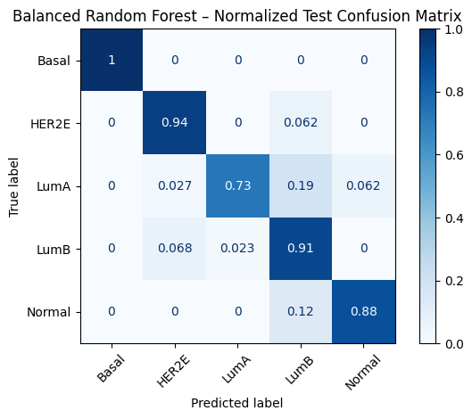
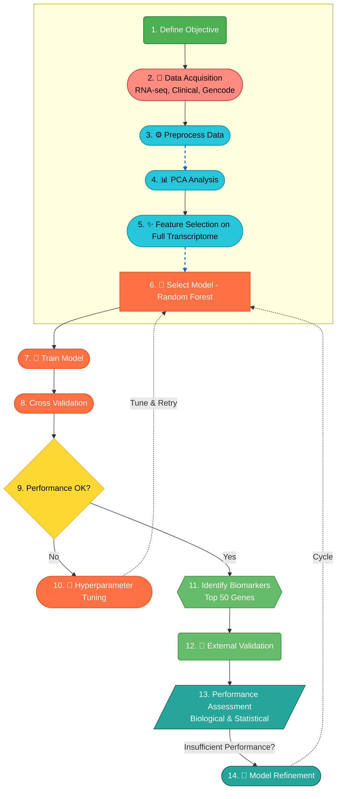

<!-- Project Banner -->
<p align="center">
  
</p>

<p align="center">
  <em>High-dimensional Genomics Analysis for Breast Cancer Subtype Classification</em>
</p>

<!-- Badges -->
[](https://www.python.org/)
[](https://scikit-learn.org/)
[](https://www.cancer.gov/tcga)
[](LICENSE)

#### 🧬 Part 1: Project Overview

This project focuses on **high-dimensional genomics data analysis**, building **interpretable machine learning models**, and identifying **robust biomarkers** for breast cancer subtypes (PAM50). It uses real **TCGA-BRCA RNA-seq data**, performs **feature selection, supervised modeling, cross-validation, and biomarker discovery**, and translates findings into **actionable insights** for R&D and clinical teams.
   
| Video Walkthrough (5 min)            | Interactive PCA Visualization                              |    Public Notebook                                                                      |
| ------------------------------------ | ----------------------------------                         |    --------------------------------                                                     |
| **[▶ Click Here to Watch the Loom]** | **[✨ Interact with the PCA](images/PCA_PCA1_PCA2.png)**  |   **[📓 Open the Colab Notebook](Notebook/01_Data_Preprocessing%20%26%20PCA.ipynb)**    |    


**Target Audience:** R&D Scientists, Bioinformatics Leads, & Pharma Hiring Managers

**Key Highlights:**
- Handled **~33,000 features** across 1,107 samples.
- Filtered for **protein-coding genes**, reducing to **16,858 features** for improved biological interpretability.
- Built **Balanced Random Forest classifiers** to predict breast cancer subtypes.
- Identified **top predictive genes** using **Gini importance** followed by **permutation validation**.
- Explored **SHAP values** for subtype-specific gene contributions and directionality.

### 🎯 Objective    
1. Classify **breast cancer subtypes** using high-dimensional RNA-seq data.  
2. Identify **robust molecular biomarkers** that drive subtype differentiation.  
3. Ensure **interpretability and clinical relevance** of predictive features.  

---
#### 🚀 Part 2: Executive Summary (The "Scientific So What?")   
**Fictional Client**: Head of Bioinformatics, 'Genoma Therapeutics' (R&D)    

#### 🎯 The Problem:   
Cancer is not one disease; it's a complex set of genomic abnormalities. Histologically similar tumors may respond differently to treatment. Subtype classification using genomic signatures is critical for **precision oncology**.

#### 💡 The Solution:   

A **machine learning pipeline** was developed to analyze **high-dimensional transcriptome data** (60,660 genes × 1,106 samples). After feature filtering low-expression and low-variance genes, the dataset was reduced to **33,472 features**.  
- Feature filtering to retain **protein-coding genes**.  
- **Random Forest classifiers** trained with cross-validation for subtype prediction.  
- **Gini importance (screening) → positive permutation importance (validation)** workflow for **robust biomarker discovery**.
- **PAM50 gene set (50 genes)** was used post hoc to **validate known molecular subtypes**.   

#### 📈 The Outcome: 

- **Balanced Random Forest** achieved:
  - Overall accuracy: **~83.03%**
  - High precision for critical subtypes (e.g., Basal-like: 100% precision)
   **21 robust biomarkers** identified for breast cancer subtype classification:
  - Overlap with PAM50: `KRT5`
  - Novel genes: `ECT2`, `SERPINF2`, `OSR1`, `TRABD2B`, `KIF20A`, `CRYAB`, `PTPRZ1`, `SGO2`, `CENPL`, `GRIA4`, `RGN`, `ID4`, `TOP2A`, `SYNM`, `SCN4B`, `BCL11A`, `SEMA3G`, `TAGLN`, `SYT8`, `CACHD1`
      
#### 🏆 Model Performance  

##### 📊 Comprehensive Evaluation Metrics
  - Balanced accuracy: **88.95%**
  - Macro F1-score: **80.63%**
  - ROC-AUC: **97.84**      
    
**Visual Summary:**       
📊      

*Figure: Confusion matrix showing per-subtype predictions. Darker colors indicate more correct predictions.*

> *Note: The model performs exceptionally well for Basal and LumA subtypes, with slightly lower precision for HER2E, LumB, and Normal due to smaller sample sizes. Detailed per-class metrics are available in the full report notebook.*
    
#### 📈 Part 3: Technical & Scientific Workflow (The "How?")
**1. Project Architecture:**  
A high-level overview of the end-to-end scientific analysis pipeline.   


**2. Strategic Tech Choices:**   

**🔷	Why Dimensionality Reduction (PCA)?**     
      ● Visualizing 33,000+ features is impossible without dimensionality reduction.
      ● PCA enables high-dimensional data visualization
      ● Using the PCA on the top selected features, the first four principal components explain 27% of variance (PC1: 11.5%, PC2: 6.2%, PC3: 4.9%, PC4: 4.4%), revealing meaningful subtype separation
      while preserving most predictive information.
      ● The low variance explained (PC1=11.5%, PC2=6.2%) suggests the data is high-dimensional and complex — many more PCs would be needed to capture most of the variance.
      
**🔷	Why Random Forest?**  
      ● Handles high-dimensional “wide” data without overfitting.    
      ● Provides feature importance for biomarker discovery.   

#### 📈 Part 4: Insights Deep Dive (The "What Did You Find?")   

**🧩 Finding 1: Clear Genomic Separation via PCA**   

**Insight:**    
Dimensionality reduction via **PCA** confirmed that **Basal-like**, **HER2E**, and **Normal** form distinct clusters in transcription space. In contrast, **Luminal A** and **Luminal B** exhibit considerable overlap-biologically 
expected finding given their shared estrogen receptor positivity and luminal epithelial origin.
The clear separation of **Normal** samples form all tumor subtypes validates sample purity and underscore the transcriptional divergence between tumor and non-tumor tissue.

Notably, the first two PCs explain only a modest variance (18%), highlighting the complexity and multi-factorial nature of tumor transcriptomes. This suggests that intristic subtype is a major source of variation along with immune infiltration, stromal composition, and batch effects.

**🤖 Finding 2: High Classification Accuracy with Random Forest**

**Insight:**          
The tuned Random Forest classifier successfully captured the genomic signatures, achieving **83% overall accuracy**. The model performed exceptionally well at identifying the **Basal-like (Triple-Negative)** subtype, with **100% precision**, which is particularly important for guiding aggressive treatment decisions.

**🧬 Finding 3: High Value Novel Biomarkers Identified**   

**Insight:**         
**Feature importance** analysis on **top-selected genes** revealed both **overlap with PAM50** and **novel biomarkers** that collectively account for a large fraction of predictive power. These provide actionable targets for faster, cost-effective diagnostic panels.

**Overlap with PAM50 Genes:** 
`KRT5`Basal marker, strong predictor across multiple subtypes.
**Novel Biomarkers (Not in PAM50):** 
`SERPINF2`, `PTPRZ1`, `BCL11A`, `SEMA3G`, `TRABD2B`, `OSR1`, `SGO2`, `KIF20A`, `GRIA4`, `CENPL`, `TOP2A`

**Validation:Biological Relevance**

**KRT5** – classic basal marker, definitive marker for Basal-like/Triple-Negative differentiation and epithelial integrity.
**BCL11A** – transcription factor associated with proliferation and basal-like subtype aggressiveness.
**PTPRZ1** – receptor tyrosine phosphatase, implicated in cell signaling and cancer progression.
**TRABD2B** – linked to Wnt signaling modulation, potentially affecting tumor growth.
**GRIA4** – glutamate receptor subunit, may influence cancer cell signaling and metastasis.
**SERPINF2** – serine protease inhibitor, involved in extracellular matrix remodeling and tumor invasiveness.
**SEMA3G** – semaphorin family member, associated with cell migration and angiogenesis.
**TOP2A** – key enzyme in DNA replication, overexpressed in proliferative tumors, known prognostic marker.
**KIF20A** – kinesin family member, drives cell division, linked to aggressive breast cancer subtypes.
**OSR1** – transcription factor, may influence epithelial-mesenchymal transition in tumors.
**SGO2** – regulator of chromosome segregation during mitosis, associated with tumor cell proliferation.
**CENPL** – component of the centromere, involved in mitotic checkpoint, proliferation-linked biomarker.

These validations show that the model not only identifies statistically important genes but also captures **biologically meaningful signals** consistent with known breast cancer pathways.

---
#### 🎯 Part 5: Actionable Recommendations (The "Now What?")

**For R&D Leadership:**

**➡️** The 83% overall accuracy (88.9% balanced accuracy) validates that genomic subtyping is a viable strategy. The next step is to validate this model on an independent, internal (e.g., in-house patient samples) to confirm clinical applicability and robustness.

**For the Biology/Lab Team:**

**➡️** Prioritize lab validation (e.g., qPCR, Western Blot) for the top 12 biomarkers (`KRT5`,`SERPINF2`, `PTPRZ1`, `BCL11A`, `SEMA3G`, `TRABD2B`, `OSR1`, `SGO2`, `KIF20A`, `GRIA4`, `CENPL`, `TOP2A`) identified by the model. 
Focus on **subtype-specific expression**, particularly for Luminal and Basal-like tumors, to guide the development of faster, targeted diagnostic assays and therapeutic strategies.

**For the Data Science/Bioinformatics Team:**

**➡️** Investigate the **Basal-like** cluster for potential sub-segmentation, as the PCA plot indicates heterogeneity within this group that current therapies may not address. Additionally, explore advanced models such as Variational Autoencoders or Graph Neural Networks to extract deeper genomic features and uncover subtle biomarkers beyond traditional feature importance.

#### 📁 Part 6: Repository & How to Run

#### Repository Structure:
```bash
Genomic-Data-Analysis-for-Cancer-Subtype-Classification/
├── 📂 data/Output/
│   └── 📄 README.md
├── 📂 notebooks/
│   ├── 🔗 01_Data_Preprocessing_and_PCA.ipynb
│   ├── 🔗 02_Model_Training_and_Biomarker_ID.ipynb
├── 📂 images/
│   ├── 🖼️ architecture_flowchart.png
│   ├── 🖼️ pca_3d_plot.png
│   ├── 🖼️ confusion_matrix.png
│   └── 🖼️ feature_importance_top20.png
├── src
└── 🔗 requirements.txt
```

#### 🧠 Why This Project Matters

Breast cancer subtypes often look identical histologically but respond differently to therapy. This project demonstrates how computational genomics helps:
- Improve diagnostic precision   
- Support targeted therapy selection    
- Accelerate drug discovery   
- Reveal novel biological insights hidden in high-dimensional data  

#### 📊 Dataset
**● Source:** TCGA-BRCA cohort   
**● Samples:** ~1,100 tumor samples   
**● Features:** ~60,660 genes (raw → normalized → scaled)   
**● Annotation:** gencode.v38, RNA-seq annotations   
**● Validation:** PAM50 biomarkers validated using intrinsic gene signatures for subtyping
**● Metadata:** clinical + demographic   

#### ⚙️ Installation & Usage
**1. Create Environment**
python -m venv .venv
source .venv/bin/activate   # macOS/Linux    
.venv\Scripts\activate      # Windows              

**2. Download TCGA-BRCA Data**
(instructions provided in `data/README.md`   

**3. Install Dependencies**
pip install -r requirements.txt

**4. Run Analysis Scripts**
python src/preprocessing.py  
python src/models.py  

**5. Explore Notebooks**      
● `01_Data_Preprocessing & PCA.ipynb`        
● `02_Model_Training & Biomarker_Discovery.ipynb`   

#### 📚 References
Wang, L., et al. (2025). Advancements in multi-omics integration for breast cancer subtyping. Nature Communications, 16(1).           
Pereira, B., et al. (2023). Deep learning approaches for cancer subtype classification from genomic data. Nature Machine Intelligence, 5(3), 245-258.        
Pereira, B., et al. (2016). The somatic mutation profiles of 2,433 breast cancers refine their genomic and transcriptomic landscapes. Nature Communications, 7, 11479.          
The Cancer Genome Atlas Network. (2012). Comprehensive molecular portraits of human breast tumours. Nature, 490(7418), 61-70.       
Curtis, C., et al. (2012). The genomic and transcriptomic architecture of 2,000 breast tumours reveals novel subgroups. Nature, 486(7403), 346-352.     
Parker, J.S., et al. (2009). Supervised risk predictor of breast cancer based on intrinsic subtypes. Journal of Clinical Oncology, 27(8), 1160-1167.    
Pedregosa, F., et al. (2011). Scikit-learn: Machine Learning in Python. Journal of Machine Learning Research, 12, 2825-2830.    

#### 📄 License
MIT License - See `LICENSE` file for details
