<!-- Project Banner -->
<p align="center">
  
</p>

<p align="center">
  <em>High-dimensional Genomics Analysis for Breast Cancer Subtype Classification</em>
</p>

<!-- Badges -->
[](https://www.python.org/)
[](https://scikit-learn.org/)
[](https://www.cancer.gov/tcga)
[](LICENSE)

## 🧬 Genomic Data Analysis for Cancer Subtype Classification

This project focuses on high-dimensional genomics data, build interpretable ML models, and translate scientific findings into actionable insights for R&D and clinical teams. It combines real TCGA-BRCA gene expression data, dimensionality reduction, supervised modeling, and biomarker discovery.
| Video Walkthrough (5 min)            | Interactive PCA Visualization      | Public Notebook                  |
| ------------------------------------ | ---------------------------------- | -------------------------------- |
| *[Screenshot here]*                  | *[Screenshot here]*                | *[Screenshot here]*              |
| **[▶ Click Here to Watch the Loom]** | **[✨ Interact with the PCA Plot]** | **[📓 Open the Colab Notebook]** |
---
### 🎯 Objective    
Classify breast cancer subtypes using RNA-seq features and identify biomarker genes driving biological differences, enabling targeted therapy decisions.    

#### 🎥 Part 1: Quick Overview   
A video walkthrough for scientific communication, an interactive visualization for data exploration, and a public notebook for technical validation.    
 
#### 🚀 Part 2: Executive Summary (The "Scientific So What?")   
**Fictional Client**: Head of Bioinformatics, 'Genoma Therapeutics' (R&D)    

#### 🎯 The Problem:   
Cancer is not one disease and it's a complex set of genomic abnormalities. Different subtypes (e.g., of breast cancer) can look identical under a microscope but respond very differently to treatment. We need a robust, computational method to classify tumors based on their core genomic signatures to advance our drug discovery pipeline.   

#### 💡 The Solution:   
I developed a machine learning pipeline to analyze high-dimensional (33,000+ features) gene expression data from The Cancer Genome Atlas (TCGA-BRCA). The pipeline classifies tumors and, more importantly, identifies the key biomarkers driving that classification.   

#### 📈 The Outcome: 
- **93% accuracy** in cancer subtype classification can distinguish between cancer subtypes (Luminal A, Luminal B, HER2-positive, Basal-like, Normal)     
- **50 key biomarkers** identified with >80% predictive power     
- **Validated target list** for therapeutic research teams      
  
#### 🏆 Model Performance  

##### 📊 Comprehensive Evaluation Metrics

| Metric | Score | Clinical Significance |   
|--------|-------|----------------------|
| **Overall Accuracy** | **93%** | High diagnostic reliability |
| **Balanced Accuracy** | 86.9% | Robust across imbalanced subtypes |
| **Macro F1-score** | 88.2% | Consistent performance across classes |
| **ROC-AUC (OvR)** | **98.7%** | Excellent class separation capability |

#### 🚀 Part 3: Technical & Scientific Workflow (The "How?")
**1. Project Architecture:**  
A high-level overview of the end-to-end scientific analysis pipeline.   

```mermaid        
flowchart TD                 
A[🔄 Data Acquisition:
RNA-seq, Clinical, PAM50, GENCODE] --> B[⚙️ Data Preprocessing & Feature Engineering]                   
    B --> C[📊 PCA Analysis]                      
    C --> D[🧬 PAM50 Gene Selection & Annotation]                      
    D --> E[✨ Feature Selection]                        
    E --> F[📝 Train & Test Split]                
    F --> G[🤖 Random Forest Classification Model
                Training & Evaluation]                 
    G --> H[🔑 SHAP Analysis & Feature Importance Ranking]                  
    H --> I[🏷️ Subtype Predictions & Biomarkers Identification]               
    I --> J[📈 Visualization Plots]             
    J --> K[🚀 Deployment Ready]                    
``` 



**2. Strategic Tech Choices:**   

**🔷	Why Dimensionality Reduction (PCA)?**            
   ● Visualizing 33,000+ features is impossible without dimensionality reduction.                     
   ● PCA reduced 51 PAM50 genes to 2 components capturing 56.7% variance.                 
   ● PCA revealed distinct subtype clusters, validating PAM50’s biological relevance.             

**🔷	Why Random Forest?**  
   ● Handles high-dimensional “wide” data without overfittingwell.    
   ● Provides feature importance for biomarker discovery.   

#### 📈 Part 4: Insights Deep Dive (The "What Did You Find?")   

**🧩 Finding 1: Clear Genomic Separation via PCA**   

**●	Insight:** Dimensionality reduction via PCA confirmed that the major breast cancer subtypes (e.g., Luminal A, Luminal B, HER2-positive, Basal-like) are not just arbitrary labels. By projecting the data from 51 PAM50 genes into 2 principal components, which captured 56.7% of the total variance, we observed distinct, separable clusters corresponding to each subtype. This demonstrates that these subtypes are driven by reproducible genomic signatures rather than random variation, validating the biological relevance of the PAM50 gene set. They form distinct, separable clusters based only on their gene expression profiles.

**🤖 Finding 2: Model Achieves 93% Classification Accuracy**

**●	Insight:** The tuned Random Forest classifier successfully learned these genomic signatures, achieving 93% overall accuracy. The model was most successful at identifying the **'Basal-like' (Triple-Negative)** subtype with (100% precision), which is critical for guiding aggressive treatment.    

**🧬 Finding 3: High Value Novel Biomarkers Identified**   

**●	Insight:** By analyzing the model's feature importances, 50 genes were found to hold over 80% of the predictive power. This provides a focused list of potential biomarkers for developing a faster, cheaper diagnostic panel.   

**●Top genes:** `ACTR3B, ANLN, BAG1, BCL2, BIRC5, BLVRA, CCNB1, CCNE1, CDC20`  

#### 🎯 Part 5: Actionable Recommendations (The "Now What?")

**For R&D Leadership:**

**➡️** The 93% accuracy validates that genomic subtyping is a viable strategy. The next step is to validate this model on an independent, internal (e.g., in-house patient) dataset.

**For the Biology/Lab Team:**

**➡️** Prioritize lab validation (e.g., qPCR, Western Blot) for the top 10 biomarkers (`ESR1, MLPH, FOXA1 , KRT14, UBE2T, SFRP1, FOXC1, KRT5 , BIRC5, NAT1`) identified by the model. These are the most promising targets for new therapeutic research.   

**For the Data Science/Bioinformatics Team:**

**➡️** Explore more advanced deep learning models (e.g., a Variational Autoencoder or a Graph Neural Network) for feature extraction, which may provide even more nuanced biomarkers than traditional feature importance.

#### 📁 Part 6: Repository & How to Run

#### Repository Structure:
```bash
Genomic-Data-Analysis-for-Cancer-Subtype-Classification/
├── 📂 data/Output/
│   └── 📄 README.md
├── 📂 notebooks/
│   ├── 🔗 01_Data_Preprocessing_and_PCA.ipynb
│   ├── 🔗 02_Model_Training_and_Biomarker_ID.ipynb
├── 📂 images/
│   ├── 🖼️ architecture_flowchart.png
│   ├── 🖼️ pca_3d_plot.png
│   ├── 🖼️ confusion_matrix.png
│   └── 🖼️ feature_importance_top20.png
├── src
└── 🔗 requirements.txt
```

#### 🧠 Why This Project Matters

Breast cancer subtypes often look identical histologically but respond differently to therapy. This project demonstrates how computational genomics helps:
- Improve diagnostic precision   
- Support targeted therapy selection    
- Accelerate drug discovery   
- Reveal novel biological insights hidden in high-dimensional data  

#### 📊 Dataset
**● Source:** TCGA-BRCA cohort   
**● Samples:** ~1,000 tumor samples   
**● Features:** ~60,660 genes (raw → normalized → scaled)   
**● Labels:** PAM50 intrinsic gene signature for setsubtype annotations   
**● Metadata:** clinical + demographic   

#### ⚙️ Installation & Usage
**1. Create Environment**
python -m venv .venv
source .venv/bin/activate   # macOS/Linux    
.venv\Scripts\activate      # Windows              

**2. Download TCGA-BRCA Data**
(instructions provided in `data/README.md`   

**3. Install Dependencies**
pip install -r requirements.txt

**4. Run Analysis Scripts**
python src/preprocessing.py  
python src/models.py  

**5. Explore Notebooks**      
● `notebooks/01_Data_Preprocessing_and_PCA.ipynb`        
● `notebooks/02_Model_Training_and_Biomarker_ID.ipynb`   

#### 📚 References
Wang, L., et al. (2025). Advancements in multi-omics integration for breast cancer subtyping. Nature Communications, 16(1).           
Pereira, B., et al. (2023). Deep learning approaches for cancer subtype classification from genomic data. Nature Machine Intelligence, 5(3), 245-258.        
Pereira, B., et al. (2016). The somatic mutation profiles of 2,433 breast cancers refine their genomic and transcriptomic landscapes. Nature Communications, 7, 11479.          
The Cancer Genome Atlas Network. (2012). Comprehensive molecular portraits of human breast tumours. Nature, 490(7418), 61-70.       
Curtis, C., et al. (2012). The genomic and transcriptomic architecture of 2,000 breast tumours reveals novel subgroups. Nature, 486(7403), 346-352.     
Parker, J.S., et al. (2009). Supervised risk predictor of breast cancer based on intrinsic subtypes. Journal of Clinical Oncology, 27(8), 1160-1167.    
Pedregosa, F., et al. (2011). Scikit-learn: Machine Learning in Python. Journal of Machine Learning Research, 12, 2825-2830.    

#### 📄 License
MIT License - See `LICENSE` file for details
